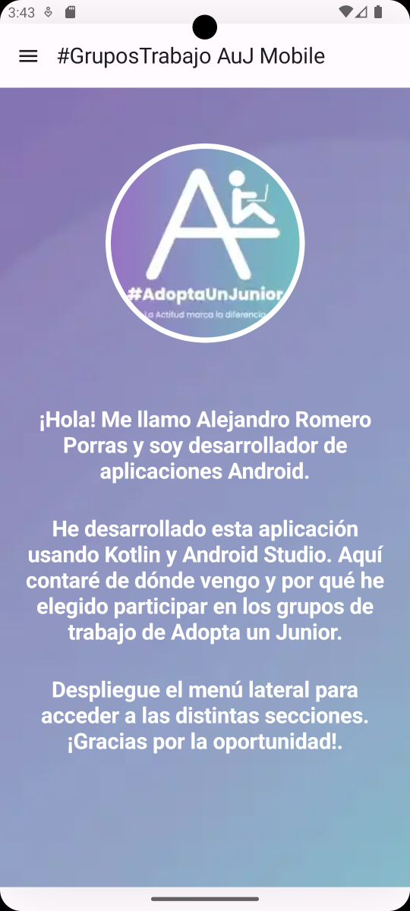
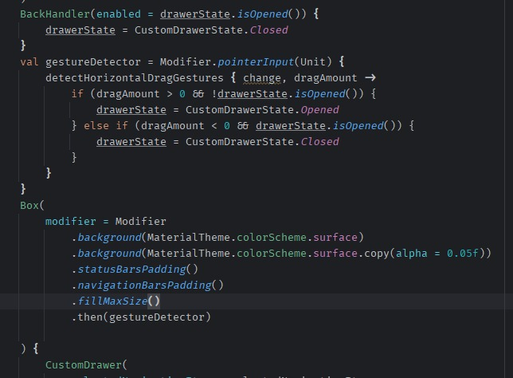

 # 
**Bienvenido a mi proyecto de Adopta Un Junior** :wave:
 

***
### 
Grupos de trabajo Mobile 
 

***
### Sobre este proyecto

Se ha realizado de forma nativa en Android Studio usando Kotlin y Jetpack Compose.
Consta de un componente personalizado (drawer) que funciona como elemento de navegación entre las distintas secciones de la aplicación.

### Pantalla de inicio y drawer de navegación

El drawer consta de 4 secciones:
- Quién soy: Esta sección es la que se abre por defecto al arrancar la aplicación, donde presento la app.
- Recorrido: Hablo de mi recorrido profesional y cómo he llegado hasta Adopta Un Junior.
- Por qué AuJ: Aquí justifico mi candidatura a los grupos de trabajo de Adopta Un Junior.
- Contacto: En este apartado encontrarán mi información de contacto.
  

### Contribuciones:

Gracias a la contribución de @AdriánRaya92 el drawer no solo se despliega pulsando los botones de la esquina superior izquierda, sino que también lo hace al deslizar el dedo horizontalmente en la pantalla.
Esta contribución se ha realizado a través de una pull request tras asignarse la issue a @AdriánRaya92. 
Esta contribución consiste en aplicarle la feature de desplazamiento por gesto táctil. Esto ha sido posible por la creación de la constante gestureDetector en el documento MainScreen.kt. Esta variable tiene un pointerInput que permite detectar la acción de arrastre horizontal cuando el dedo toca la pantalla. Una vez expresada esta constante, se le llama en el Box que contiene el componente CustomDrawer como una extensión más del atributo Modifier (.then(gestureDetector)).

### ¿Por qué deberia ser seleccionado para los grupos de trabajo de desarrollo mobile?

 
Si bien es verdad que he hecho una reconversión laboral y no tengo la formación universitaria habitual, me he estado formando con muchas ganas y poniendo en práctica cada nueva tecnología que aprendo. Acepto los consejos y enseñanzas de los demás y soy una persona disponible para ayudar a los demás en lo que pueda. Programar no es fácil, pero intento hacerlo lo más llevadero posible cuanto trabajo en un equipo. Participar en estos grupos me otorgará una oportunidad para adquirir experiencia real que, comprensiblemente, ninguna empresa me quiere dar. Así que quiero demostrar que con mucho esfuerzo, apoyo y trabajo, puedo ser una pieza valiosa dentro de un equipo. Mi recorrido profesional como profesor me ha hecho una persona que procura crear un clima agradable, comprender bien las jerarquías dentro de un equipo, querer ayudar a los demás, buscar soluciones ante problemas inesperados y coordinar los distintos roles que pueden crearse en un equipo.

